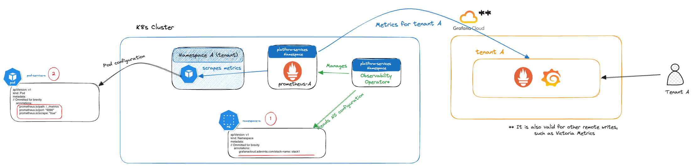

# Send Pod metrics to Grafana Cloud

> [!NOTE]
> Administrators can modify the domain of the cluster, which will affect the domain used by label and annotation keys.
> If the cluster's domain is `example.com` the labels and annotations will match it, e.g. `grafanacloud.example.com/stack-name`.
>
> In this document we'll use `adevinta.com` as the cluster domain.

## Overview

To send [`Pod`][k8s-pod] metrics to Grafana Cloud, you'll need two steps:

1. To configure your team's Grafana Cloud stack (account) in your [`Namespace`][k8s-namespace] definition, using the **[annotation][k8s-annotation]** `grafanacloud.adevinta.com/stack-name: <YOUR STACK NAME>`.
2. To annotate your [`Pods`][k8s-pod] with the **[annotations][k8s-annotation]**:
  1. `prometheus.io/scrape: "true"` (**Mandatory**, _string_). This will tell us that we must ingest the [`Pod`][k8s-pod]'s metrics
  2. `prometheus.io/path: <YOUR PATH>` (**Mandatory**, _string_). The path where Prometheus should get the metrics.
  3. `prometheus.io/port: "9090"` (**Optional**, _string_). The port where Prometheus should get the metrics. It may be the same as your pod, if you have an HTTP service, or it may be a different one. By default, Prometheus will scrape, by default, all exposed container ports. In most cases, you don't need this configuration.
  4. `monitor.adevinta.com/pod-sample-limit: <sample limit>` (**Optional**, _string_). This will tell the sample limit allowed by the prometheus for that pod, by default is set to 4500. (this flag is still experimental and could change in the future)



## Configuring your namespace

Below there's an example of how to configure your [`Namespace`][k8s-namespace]:

```diff
apiVersion: v1
kind: Namespace
metadata:
  # Ommitted for brevity
  annotations:
+   grafanacloud.adevinta.com/stack-name: mymicroservicestack
```

> [!NOTE]
> By leveraging the `grafanacloud.adevinta.com/stack-name` annotation, your team can have multiple namespaces using the same Grafana Cloud stack.

After the configuration is applied, the metrics will start flowing to your Grafana Cloud stack.

## Using multiple Grafana stacks

Below there's an example of how to configure your [`Namespace`][k8s-namespace] to forward metrics to multiple Grafana stacks:

```diff
apiVersion: v1
kind: Namespace
metadata:
  # Ommitted for brevity
  annotations:
+   grafanacloud.adevinta.com/stack-name: firststack,secondstack
```

> [!NOTE]
> By leveraging the `grafanacloud.adevinta.com/stack-name` annotation, your team can have multiple namespaces using **multiple** Grafana Cloud stacks.

After the configuration is applied, the metrics will start flowing to your Grafana Cloud stacks.

## Disable metrics or logs to be sent to your Grafana Cloud Stack

You have the option to disable logs, metrics, or both from being sent to your Grafana Cloud Stack, giving you complete flexibility in choosing what to utilize.

### Disable metrics:
```diff
apiVersion: v1
kind: Namespace
metadata:
  # Ommitted for brevity
  annotations:
+   grafanacloud.adevinta.com/metrics: disabled
```

### Disable logs:
```diff
apiVersion: v1
kind: Namespace
metadata:
  # Ommitted for brevity
  annotations:
+   grafanacloud.adevinta.com/logs: disabled
```

[k8s-annotation]: https://kubernetes.io/docs/concepts/overview/working-with-objects/annotations/
[k8s-pod]: https://kubernetes.io/docs/concepts/workloads/pods/
[k8s-namespace]: https://kubernetes.io/docs/concepts/overview/working-with-objects/namespaces/
