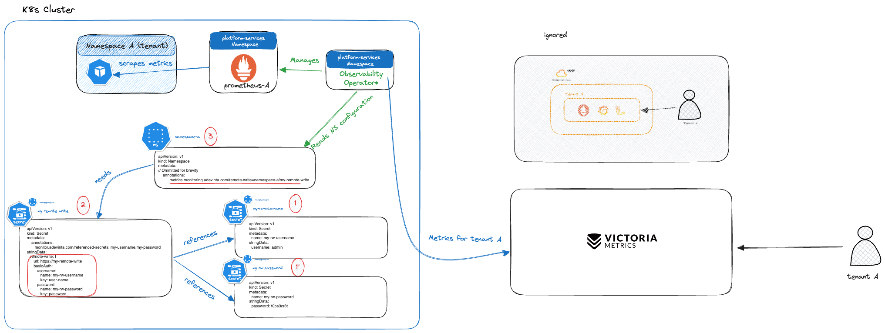

# Send Pod metrics to a different backend

## Overview

By default, the operator sends metrics to the corresponding Grafana Cloud stack, either [via convention or configuration](../01-send-pod-metrics/README.md).

You can change this behaviour, setting a custom [storage][prometheus-storage-docs] (`remoteWrite`). For instance, this may be useful to configure a [Victoria Metrics][victoria-metrics] backend to store your metrics:



[Zoom](../images/send-data-different-backend.png) | [Diagram source](../images/source/send-data-different-backend.excalidraw) | [Shareable link][send-metrics-different-backend-shareable-link]

## Configuring the backend

If you want to use this feature, you need to annotate your [`Namespace`][k8s-namespace], with a [`remoteWrite`][prometheus-remote-write-docs] configuration:

```diff
apiVersion: v1
kind: Namespace
metadata:
  annotations:
    # Ommitted for brevity
+   metrics.monitoring.adevinta.com/remote-write={namespace}/{secret-name}
```

In the above example, `{secret-name}` is a reference to a [Secret][k8s-secret] created in the cluster.

> [!NOTE]
> If the [Secret][k8s-secret] is defined in the same namespace where it's being configured, then you do not need to namespace it. So, in that case, you may eliminate the `{namespace}/` part.

The content of the secret is a [`remoteWrite`][prometheus-remote-write-docs] spec as well as references to secrets that need to be used:

```yaml
apiVersion: v1
kind: Secret
metadata:
    name: my-remote-write-secret
    annotations:
       monitor.adevinta.com/referenced-secrets: my-secret,my-secret-2
stringData:
   remote-write: |
      url: https://my-remote-write
      basicAuth:
         username:
            name: my-secret
            key: user-name
         password:
            name: my-secret-2
            key: password
```

Observability Operator then configures the tenant's Prometheus [`remoteWrite`][prometheus-remote-write-docs] accordingly.

[k8s-namespace]: https://kubernetes.io/docs/concepts/overview/working-with-objects/namespaces/
[k8s-secret]: https://kubernetes.io/docs/concepts/configuration/secret/
[prometheus-storage-docs]: https://prometheus.io/docs/prometheus/latest/storage/#remote-storage-integrations
[prometheus-remote-write-docs]: https://prometheus.io/docs/prometheus/latest/configuration/configuration/#remote_write
[send-metrics-different-backend-shareable-link]: https://excalidraw.com/#json=Jj-IkULKwAafn4b_IHygp,YzbiPd5xoJBGRfbuddInOA
[victoria-metrics]: https://victoriametrics.com/