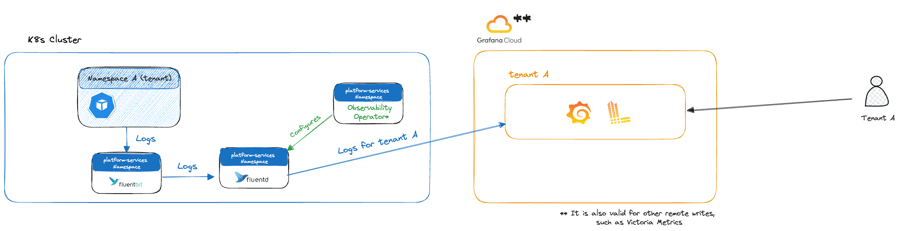

# Configure the logging backend for Grafana Cloud's Loki

> [!NOTE]
> Administrators can modify the domain of the cluster, which will affect the domain used by label and annotation keys.
> If the cluster's domain is `example.com` the labels and annotations will match it, e.g. `grafanacloud.example.com/stack-name`.
>
> In this document we'll use `adevinta.com` as the cluster domain.

## Overview

To send [`Pod`][k8s-pod] logs to Grafana Cloud, you'll need one step:

1. To configure your team's Grafana Cloud stack (account) in your [`Namespace`][k8s-namespace] definition, using the **[annotation][k8s-annotation]** `grafanacloud.adevinta.com/stack-name: <YOUR STACK NAME>`.



## Configuring your namespace

Below there's an example of how to configure your [`Namespace`][k8s-namespace]:

```diff
apiVersion: v1
kind: Namespace
metadata:
  # Ommitted for brevity
  annotations:
+   grafanacloud.adevinta.com/stack-name: mystack
```

> [!NOTE]
> By leveraging the `grafanacloud.adevinta.com/stack-name` annotation, your team can have multiple namespaces using the same Grafana Cloud stack.

After the configuration is applied, the logs will start flowing to your Grafana Cloud stack.

## Using multiple Grafana stacks

Below there's an example of how to configure your [`Namespace`][k8s-namespace] to forward logs to multiple Grafana Cloud stacks:

```diff
apiVersion: v1
kind: Namespace
metadata:
  # Ommitted for brevity
  annotations:
+   grafanacloud.adevinta.com/stack-name: firststack,secondstack
```

> [!NOTE]
> By leveraging the `grafanacloud.adevinta.com/stack-name` annotation, your team can have multiple namespaces using **multiple** Grafana Cloud stacks.

After the configuration is applied, the logs will start flowing to your Grafana Cloud stacks.

## Opting out from logs

If you want to opt out from having logs in your Loki, you'll need to annotate your [`Pods`][k8s-pod]:

```diff
apiVersion: apps/v1
kind: Deployment
spec:
  template:
    spec:
      metadata:
        annotations:
+           grafanacloud.adevinta.com/logs: disabled
```

[k8s-annotation]: https://kubernetes.io/docs/concepts/overview/working-with-objects/annotations/
[k8s-pod]: https://kubernetes.io/docs/concepts/workloads/pods/
[k8s-namespace]: https://kubernetes.io/docs/concepts/overview/working-with-objects/namespaces/