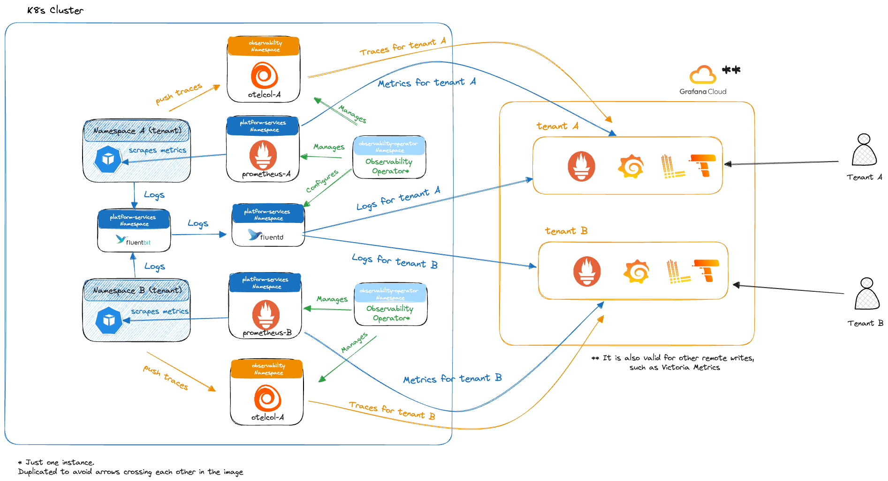

# Observability Operator

Observability Operator allows to dynamically create [`PodMonitor`][prom-operator-podmonitor-docs] and [`Prometheus`][prom-operator-prometheus-docs]
objects, based on Prometheus Operator, in a Kubernetes cluster. 

These Prometheuses can then use a `remoteWrite` to send the metrics to a backend such as [Grafana Cloud][grafana-cloud] or
[Victoria Metrics][victoria-metrics].

Observability Operator can also dynamically create OTel Collectors for those user namespaces that request tracing capabilities.

If you're looking into how to contribute to this project, look into the [contributing guidelines](../CONTRIBUTING.md).

## Overview

Below there's an image with an architecture overview of the metrics, traces and logging collection using Observability Operator:

## Features

There are four main features provided by the Observability Operator:

1. [Send Pod metrics to Grafana Cloud](01-send-pod-metrics/README.md)
2. [Send Pod metrics to a different backend](02-send-pod-metrics-different-backend/README.md), such as [Victoria Metrics][victoria-metrics]
3. [Configure the logging backend for Grafana Cloud's Loki](03-configure-loki/README.md)
4. [Manage synthetic monitors for your Ingresses](04-manage-synthetic-monitors-ingress/README.md)
5. [Send Pod traces to Grafana Cloud](05-send-pod-traces/README.md)

[grafana-cloud]: https://grafana.com/products/cloud/
[prom-operator-podmonitor-docs]: https://prometheus-operator.dev/docs/operator/design/#podmonitor
[prom-operator-prometheus-docs]: https://prometheus-operator.dev/docs/operator/design/#prometheus
[victoria-metrics]: https://victoriametrics.com/